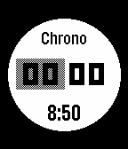
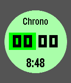
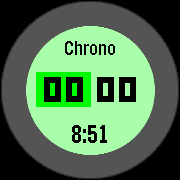
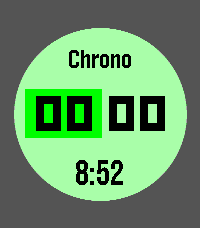
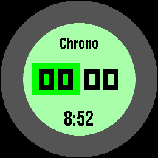

# Pebble Timer++

A timer and stopwatch for the Pebble smartwatch, with battery life as the point: tell it how
coarsely to show the time while it is a long way from zero and it stops waking every second to
redraw. Digits it is no longer refreshing show as `_` rather than a stale value.

Also here: touch controls, a colour of its own for counting down and for counting up, and a split
for the stopwatch. It runs in the background using the WakeUp API, so there is no need to keep the
app open. Holding select resets at any point, and starting a timer from 0:00 turns it into a
stopwatch.

A fork of [Timer+](https://github.com/YclepticStudios/pebble-timer-plus) by way of
[BrianEnders's touch fork](https://github.com/BrianEnders/pebble-timer-plus-touch).

|                             Aplite                              |                      Basalt                       |                      Chalk                      |                             Diorite                              |                      Emery                      |                             Flint                              |                      Gabbro                       |
| :-------------------------------------------------------------: | :-----------------------------------------------: | :---------------------------------------------: | :--------------------------------------------------------------: | :---------------------------------------------: | :------------------------------------------------------------: | :-----------------------------------------------: |
|  |  |  |  |  |  |  |

## Controls

| Button       | Setting a timer           | Counting down                     | Counting up                                     |
| ------------ | ------------------------- | --------------------------------- | ----------------------------------------------- |
| Select       | Next field, then start    | Pause                             | Pause                                           |
| Up / Down    | Change the selected field | Peek: the exact time for a second | Split: hold the reading while the clock runs on |
| Select, held | Reset to zero             | Reset to zero                     | Reset to zero                                   |
| Back         | Back a field, or leave    | Leave                             | Leave                                           |

Select is always the state change and a held select is always the reset; up and down set the time
while it is stopped and ask for the exact one while it runs. Pausing keeps the time, including a
stopwatch's, so it can be read, adjusted and started again.

The header says which of the two the watch is doing, and reads `Split` while a time is held or
`Alarm` while a timer is going off. Any button stops the buzzing then and does nothing else by it —
except select, which also hands back the time the timer was set to, and select held, which resets.

On touch watches the click wheel turns for up and down, a tap in the centre acts as select, and a
swipe left acts as back.

## Settings

Configured from the Pebble app.

### Display updates

Two settings each switch on a coarser update rate from a threshold outwards, measured on the time
remaining counting down and the time elapsed counting up:

| Setting                   | Effect                                    | Display |
| ------------------------- | ----------------------------------------- | ------- |
| `10-second updates above` | Redraw every 10 seconds from this far out | `5:3_`  |
| `Minute updates above`    | Redraw once a minute from this far out    | `5:__`  |

Both default to *Never*, the original once-a-second behaviour. Where they overlap the coarser one
takes over, and the settings page switches the 10-second setting to *Never* to say so.

Live seconds always show while setting a timer, while paused, on a split, and for the twenty
seconds an elapsed timer vibrates. Up or down asks for the exact time at any other point: counting
down it shows for a second, counting up it holds until you let it go. On colour watches the
progress ring shades the stretch the masked digits could mean, so it never claims to know more than
they do.

### Colours

Counting down and counting up each get their own accent, both green to start. Set them apart and a
timer running past zero changes colour as it becomes a stopwatch, and a stopwatch keeps its colour
while it is paused. Only the ring colour is chosen;
the middle and the interval band are shaded from it, so only colours that stay legible when shaded
are offered. Colour watches only.

## Building

Build a `.pbw` with the [`pebble`](https://github.com/pebble-dev/pebble-tool) CLI:

```sh
pebble build
```

For formatting and intellisense in VS Code, generate `compile_commands.json` — redo this whenever
the build configuration changes:

1. Install `bear`: `sudo apt install bear`.
2. Clean, so every command is captured: `pebble clean`.
3. `mkdir -p build`.
4. `bear --output build/compile_commands.json -- pebble build`.
5. Run `Show Recommended Extensions` and install the suggestions.
6. Run `clangd: Restart language server`.

## Acknowledgements

This app is other people's work with some of mine on top.

- **[Timer+](https://github.com/YclepticStudios/pebble-timer-plus)** by
  [Ycleptic Studios](https://github.com/YclepticStudios) — the original, and everything that makes
  it worth using: the progress ring, the scalable digits, the whole design.
- **[pebble-timer-plus-touch](https://github.com/BrianEnders/pebble-timer-plus-touch)** by
  [BrianEnders](https://github.com/BrianEnders) — the touch controls, built on his
  [RotaryKit](https://github.com/BrianEnders/pebble-rotary-kit) library, vendored here.
- **[pebble-instant-timer](https://github.com/howeaj/pebble-instant-timer)** by
  [howeaj](https://github.com/howeaj) — the idea of saving battery by refreshing the display less
  often than once a second, which the display update settings came from.

Work on this fork was assisted by [Claude Code](https://claude.com/claude-code).

## License

MIT. See [LICENSE.md](LICENSE.md).
